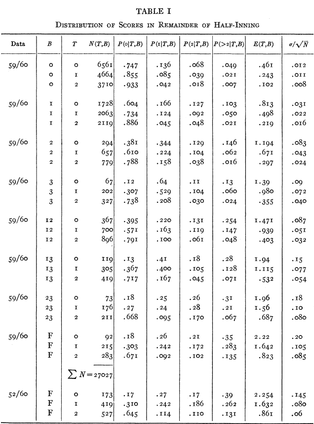
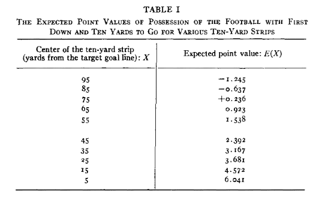
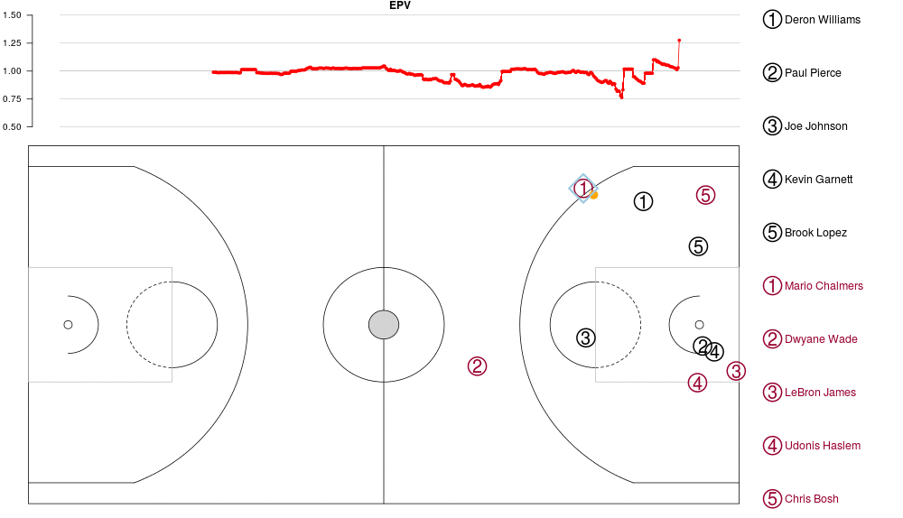

```{r setup, echo=FALSE, message=FALSE}
knitr::opts_chunk$set(
  echo = FALSE,
  message = FALSE,
  warning = FALSE,
  fig.align = 'center'
)
library(tidyverse)
theme_set(theme_bw())
library(kableExtra)
```

```{r pkg}
knitr::write_bib(
  c(
    "base",
    "Lahman", 
    "pitchRx", 
    "retrosheet",
    "teamcolors",
    "ggplot2",
    "BradleyTerry2",
    "nflfastR",
    # "nflscrapr", no longer supported, can no longer be installed
    "nflverse",
    "xgboost",
    "chess", 
    "chessR",
    "sportyR",
    "nflplotR",
    "baseballr"
  ),
  file = "pkgs.bib"
)

xfun::gsub_file(
  "pkgs.bib",
  "\\{Jason Zivkovic\\}",
  "Zivkovic, Jason"
  )
```

```{=latex}
\newcommand{\pkg}[1]{\textbf{#1}}
```

<!--

> Charge: Given your expertise and background, a review article from your group related to the topic of Statistical tools for sports analytics (e.g. baseball) would significantly contribute to WIREs Computational Statistics.
>
> The article should critically present the current state-of-the-art research, include opposing viewpoints, and identify challenges and opportunities.


**Remember that you are writing for an interdisciplinary audience. Please be sure to discuss interdisciplinary themes, issues, debates, etc. where appropriate.** Note that the WIREs are forums for review articles, rather than primary literature describing the results of original research.

## Article Category

- Overview


-->

# Introduction

<!--

> Introduce your topic in ~2 paragraphs, ~750 words.

> While Wiley does consider articles on preprint servers (ArXiv, bioRxiv, psyArXiv, SocArXiv, engrXiv, etc.) for submission to primary research journals, preprint articles should not be cited in WIREs manuscripts as review articles should discuss and draw conclusions only from peer-reviewed research. Remember that original research/unpublished work should also not be included as it has not yet been peer-reviewed and could put the work in jeopardy of getting published in the primary press.

-->

Insights derived from the analysis of data have transformed the world of sports over the last few decades. 
While baseball---a naturally discrete sport with more than a century's worth of professional data---may be the sport with the longest relationship with sports analytics, one would be hard-pressed to identify a professional sport today in which sports analytics is not having an impact. 
In basketball, analytics has driven a shift in the conventional wisdom about shot selection. 
Most teams are shooting more three-pointers, settling for fewer long two-point shots, deploying more versatile defenders, and relying less on the strategy of pounding the ball into the paint in an attempt to get a high-percentage shot [@Schuhmann2021nba3point].
In American football, teams are going for it on fourth down far more often than in the past, a direct result of statistical analysis showing that most teams were previously overly conservative [@lopez2020bigger].
And, of course, in baseball, teams are using defensive shifts to maximize the probability of recording an out, encouraging hitters to improve their launch angles, and optimizing pitcher repertoires to minimize contact [@healey2017new]. 

These are just the most obvious examples of strategic changes that are fueled by insights extracted from data by practitioners of sports analytics.
Similar insights are now being made in less obvious settings, including esports [@clark2020bayesian; @maymin2021smart]. 
These insights come both from academia, where researchers typically use public data to produce high-caliber, peer-reviewed scientific work, as well as from industry, where highly-trained analysts work with with players, coaches, and team officials to put new ideas into immediate effect thanks to high-resolution, often proprietary data.
A growing pool of people move seamlessly between these two worlds, leading to the formation of partnerships and the cross-pollination of ideas. 

Every sport is different, with its own set of rules, strategies, methods of data collection, number of players, and the magnitude of the role of chance. 
At the same time, many sports are similar, either because one evolved from the other, or the structure of the games share certain attributes. 
Sports that are closely related historically may or may not share common applications of analytical methods. 
For example, despite belonging to the same bat-and-ball family, baseball and cricket differ in strategies such as batting order or sacrifice plays.
Conversely, with just a few small tweaks, analytical metrics might work just as well across sports that are unrelated and quite different.
For instance, an Elo rating could be equally valid for chess players and ice hockey teams. 

In this paper, we explore four key ideas that have widespread applicability across many sports: the expected value of a game state (Section \ref{sec:ev}), win probability (Section \ref{sec:wp}), measures of team strength (Section \ref{sec:strength}), and the use of sports betting market data (Section \ref{sec:betting}). 
In each case, we define the concept mathematically, explain how it originated, and give examples of its applications in multiple sports. 
Our goal is to unify the conceptual threads, while doing some justice to the customizations necessary to make a metric meaningful in a particular sport. 
We include copious references to original works of scholarship.

Doing the work of sports analytics requires computing with data. 
While the sources of sports data are too numerous to list, in Section \ref{sec:tools} we highlight a few computational tools (including a table of R packages) that make this kind of work possible. 
Section \ref{sec:opportunities} lists several opportunities for disseminating work publicly. 
We conclude in Section \ref{sec:conclusion} with a short discussion of some ideas that are not explored in this paper. 
Notably, we omit a treatment of individual player ratings for team sports, since this concept has been covered ably in these pages by @Albert2015, and its inclusion would double the length of this manuscript.
We do, however, discuss individual player ratings in the context of one-person teams (e.g., chess, tennis) in Section \ref{sec:strength}.

We encourage readers to explore @cochran2017oxford and @Albert2017handbook for collections of articles in sports analytics that provide broad coverage of the field. 

# The expected value of a game state {#sec:ev}

In many sports, the first step towards an analytical understanding is the estimation of the expected value of a game state at any given point in it. 
Mathematically, we define $X$ to be a random variable indicating the number of points (or runs) that a team will score over some determined amount of time (e.g., remainder of game, quarter, period, or inning). 
Let $s \in S$ be a tuple that encodes the *state* of a game. 
Then our task is to estimate:

\begin{equation}
  \mathbb{E}[X | s] = \sum_{x \geq 0} \Pr[X = x | s] \cdot x\,,
\end{equation}

for any state $s \in S$, where $\Pr[X = x | s]$ is the probability of scoring $x$ points given that the game is in state $s$ and $S$ is the set of all possible states. 

The concept of a state is easier to grasp in a sport that can be modeled as *discrete* (in the sense of [discrete event simulation](https://en.wikipedia.org/wiki/Discrete-event_simulation)). 
By discrete, we mean a sport that can be easily broken into short, distinct segments of action which are typically summarized categorically. 
Each of these segments might represent a state $s$. 
For example, each pitch in baseball is either a ball or a strike. 
If the ball is put in play, then there may be a complex sequence of movements by the players, but ultimately (within a few seconds) that sequence will end and no more action will be permitted until the next pitch. 
At the beginning and end of each phase of action, we will know definitively which team is on offense and defense, which runners are on which bases, the score, how many outs there are, etc. 
Tennis could similarly be viewed as a series of discrete actions defined by each point. 
To say that a player is winning 6-2, 3-1, 40-15 and serving with one fault committed is to characterize the state of the match.
In American football, the game can be broken down into a discrete sequence based on each down. 
Contrast this to sports like lacrosse, soccer, or any variant of hockey, which feature largely running clocks and continuous player movement. 
In these sports, it is not obvious how to break up the action into discrete chunks. 

In this Section, we illustrate how the fundamental concept of the expected value of a game state leads to compelling findings in a variety of sports.

## Discrete event analysis

First, we explore results derived from the expected value of a state in sports where discrete event analysis is common. 
We draw primarily on baseball and American football, but applications in other sports (e.g., tennis) are common (see for example, @kovalchik2019calibration). 

### In baseball, the expected run matrix

In baseball, $s$ is typically determined by two factors: the configuration of the runners on base (there are 8 possibilities) and the number of outs (3 possibilities). 
Thus, there are $|S| = 24 = 8 \cdot 3$ basic states of an inning in baseball[^state], and we are often interested in the number of runs that will be scored from some state until the end of the inning. 
In this example using baseball, $\mathbb{E}[X | s] \,$ is the expected number of runs scored between now and the end of the inning given that the inning is currently in state $s$. 
The collection of estimates $\mathbb{E}[X | s]$ for all 24 states is called the *expected run matrix* [^matrix], and it is foundational in baseball analytics. 


[^state]: 25, if you include the absorbing state of 3 outs that describes the end of an inning.

[^matrix]: There is no inherent dimensionality to $\mathbb{E}[X | s]$. The *matrix* nomenclature stems from its values typically being displayed in $8 \times 3$ grid. However, when computing with $\mathbb{E}[X | s]$, it is most often convenient to treat it as a $24 \times 1$ vector. 


```{r lindsey, out.width="90%", fig.cap="Table 1 from Lindsey's original paper. The column labeled $E(T, B)$ gives the expected run matrix as a vector, based on Lindsey's analysis of Major League Baseball data from 1959 and 1960. "}

```


```{r erm, echo=FALSE}
lindsey <- c(
  .461, .243, .102,
  .813, .498, .219,
  1.194, .671, .297,
  1.39, .98, .355,
  1.471, .939, .403,
  1.94, 1.115, .532,
  1.96, 1.56, .687,
  2.22, 1.642, .823
)
erm <- tibble(
  Base = rep(0:7, each = 3),
  Out = rep(0:2, times = 8),
  Runs = lindsey
)
```

```{r lindsey-erm}
int2bin <- function(x) {
  x |>
    map(intToBits) |>
    map(rev) |>
    map(tail, 3) |>
    map(str_sub, 2) |>
    map_chr(paste, collapse = "")
}
#int2bin(0:7)

erm |>
  pivot_wider(names_from = Out, values_from = Runs) |>
  mutate(Base = int2bin(Base)) |>
  kable(booktabs = TRUE, 
        linesep = "",
        caption = "George Lindsey's expected run matrix. Note how (when reading across the rows) the expected runs decrease as outs increase for the same configuration of baserunners, while (when reading down the columns) expected runs generally increase as baserunners advance. 000 means no runners on base, and 110 means runners on second and third bases. \\label{tab:erm}") |> 
  add_header_above(c("", "Out" = 3))
```


Early work on this topic can be found in @lindsey1963investigation, who used play-by-play data to compute an empirical estimate for the mean number of runs scored in the remainder of the inning for each of these 24 possible states of an inning. 
This line of work led to analysis of all types of common baseball strategies. 
For example, many baseball teams elect to attempt a sacrifice bunt with a runner on first and no one out in the inning, with the goal of moving the runner to second base, at the cost of the batter being out. Figure \ref{fig:lindsey} shows a reproduction of @lindsey1963investigation's original calculations, and Table \ref{tab:erm} shows the expected run matrix in its most common form. 


@Tango2007book (and many subsequent analyses) conclude that the sacrifice bunt is rarely worth it, because most teams would be expected to score more runs with a runner on first and no outs than they would with a runner on second and one out. 

It is worth emphasizing that the values in $\mathbb{E}[X | s]$ are estimates, and the precision of those estimates has many subtleties. 

First, the values within the expected run matrix change over time. 
For example, any estimation of the values in the expected run matrix based on data from a high-scoring era (e.g., the early 2000s) will yield different values than equivalent analysis in a low-scoring era. 
In a high run-scoring environment, where there are many home runs, the value of a walk may be higher, since a player who walks is more likely to score on a subsequent home run. 
Conversely, in a low run-scoring environment where hits are hard to come by, stolen bases and sacrifice bunts may be comparatively more valuable. 
Thus, a careful estimate of $\mathbb{E}[X | s]$ would include a time parameter $t$, indicating when the estimate is appropriate. 

Second, the characterization of $S$ as having 24 states is only the simplest possible. 
The inning, or the score of the game, or even the weather, could be incorporated into $S$, as those conditions might reasonably affect the estimate of $\mathbb{E}[X | s]$. 
More definitively, the identity of the current batter, pitcher, or batter on deck, might also affect the estimate of $\mathbb{E}[X | s]$. 
Indeed, @Tango2007book show that when a particularly weak-hitting batter is up (i.e., the pitcher), a sacrifice bunt becomes a more effective strategy.  

See @Albert2001curve for a fuller discussion of the use of the expected run matrix in baseball and @marchi2018analyzing for examples of how to estimate the expected run matrix using Retrosheet data and the R statistical computing language [@R-base]. 

### In American football, expected points {#sec:football}

The concept of estimating the value of the state of a game is easily extended to other sports. 
For example, in American football, $s$ is determined by situational variables such as down, yardage to the next first down, time remaining in the game, and field position. 

The task of estimating expected points of possession in football goes back to @Carter1971operations, who estimate the expected points for 1st and 10 plays in the NFL, given any yard line on the football field. 
Due to limitations regarding the amount of data collected, the authors divide football field into 10-yard buckets, centered at their midpoints (e.g. 5, 15, 25, 35, etc.), before averaging the value of the next scoring instance across the field to obtain the expected points.
Figure \ref{fig:carter} shows a reproduction of @Carter1971operations's estimates. 
As expected, the estimated expected points increases monotonically as the teams gets closer to the endzone.
One limitation of this approach is the linearity assumption, which results in a high negative expected point value when the offensive team is 95 yards away from the opponent's goal line.

```{r carter, fig.cap="Table 1 from Carter and Machol's original paper. Note the monotonic increase in expected point values as the team gets closer to the endzone. ", out.width="100%"}

```

Early work on expected point values in American football can also be found in @Carroll1988hidden.
In particular, the authors consider a similar approach to @Carter1971operations and propose a linear model for expected points in the NFL.
They determine that every extra 25 yards is associated with 2 more points scored on average for a football team.

Other attempts at modeling expected points in football are @goldner2012markov and @goldner2017situational, who propose a Markov framework.
In particular, the author considers a football drive as an *absorbing Markov chain*, consisting of distinct *absorbing states* that include touchdowns, field goals, and other possession outcomes. 
An absorbing state is a link in a Markov chain from which there are no possible transitions (i.e., it is the end of the chain).
For any given play, the expected points are calculated using the absorption probabilities for different scoring events.

A more in-depth overview of the history of expected points in sports is provided in @Yurko2019nflwar (Section 1.1). 
Most importantly, @Yurko2019nflwar use publicly available data provided by the **nflscrapR** package [@R-nflscrapR] to model the expected points on a play-by-play level in football.
The authors introduce a multinomial logistic regression approach, which takes into account the current down, time remaining, yards from endzone, yards to go, and indicators for goal down situation and whether there are less than two minutes remaining in the half. 
Their model estimates the probabilities of the following possible scoring outcomes after each play: no score, safety, field goal, and touchdown for both the offensive and defensive teams, all of which have a point value.
The expected points for a play can then be calculated accordingly, by summing up the products of the scoring event point values and their associated probabilities (see Equation 1).

In addition, @pelechrinis2019 develop an expected points framework in the same spirit as the previous work, but account for the strength of the opponents in their method.
They state that by failing to account for opponent strength appropriately, about 124.8 points per team each season (or about 3.8 wins per season) are not credited correctly.
This is a substantial amount in a 16-game season. 

<!-- XX Seems massive -->

### In American football, 4th down strategy

The concept of expected points in American football has many applications.  One of the most notable and well-studied topics is the evaluation of 4th down strategy.
There is near universal consensus in the literature that NFL teams have been too conservative in the past when making 4th down decisions. 

@Romer2006 examines 4th down decisions in the NFL using expected points by focusing only on examples from the first quarter of a game (to avoid issues with end-of-half and end-of-game decision making). 
They concluded that teams don't go for it enough if teams are trying to maximize their probability of winning the game. 

Numerous other papers (see @lopez2020bigger for details) use the analysis of the expected number of points to improve fourth down strategy. In addition to @Romer2006, later work by @Yam2019 uses win probability (see Section \ref{sec:wp}), rather than expected points, and a causal inference framework to reach similar conclusions that NFL teams are too conservative in going for it on 4th down.  In addition, they estimate that a better strategy would be worth about 0.4 wins per season on average, a substantial amount comparable to the effect size reported by @pelechrinis2019 above. 

@lopez2020bigger presents an introduction to NFL tracking data, and examines 4th down behavior as an example of the type of problem that can be more thoroughly studied with the increase in granularity of the tracking data over traditional NFL data.
In the past, when looking at down and distance data to study whether NFL coaches are making good decisions about whether to "go for it" or punt on 4th down, the distance data is only a rounded approximation of the true distance "to go" (i.e. 1 yard, 1 foot, and 1 inch will all be recorded as 4th and 1. 
In fact, anything up to 2 yard will recorded as 4th and 1 [@lopezDM]. However, a coach on the field during a game will be able to clearly see the difference between 1 inch and 1 yard, and this information will factor into their decision making. 
With tracking data, the "to go" distance can be much more accurately assessed and therefore evaluation of 4th down coaching decisions can now account for this "extra" information that is available to a coach on the field of play, but not recorded in traditional NFL data. 
Many past analyses of the decision to go for it or not on 4th down conclude that coaches in the NFL are too conservative in their decision making. 
@lopez2020bigger also concludes that coaches are too conservative on 4th down decision making, but notes further that past estimates of the magnitude of how conservative coaches are on 4th down may be overstated due to the way in which to go yardage was recorded only approximately in the past.


### Other applications of expected points in American football

Researchers have also applied the notion of expected points to investigate other aspects of the game of football, including quarterback performance and coaching decisions. 

For quarterback evaluation, @White2002 present a tiered logistic regression method that can be, in general, applied to any regression setting with a polychotomous response.  Using this technique, they estimate the value of NFL plays using a simple expected points model with down, yards to go, and yards to goal as predictors.  Accordingly, the model results are utilized to obtain ratings and rankings for NFL passers.

@Alamar2010 implements an expected points framework to examine play calling in the NFL. However, rather than assessing each play on its own, they evaluate the play in the context of the drive. 
Based on play-by-play data from 2005 through 2008, they determine that teams are under-utilizing passing plays in some situations.  

Another application of expected points is to evaluate kickoff decisions made by football coaches, as demonstrated by @urschel2011.
Specifically, they look at surprise on-sides kicks versus regular kickoffs and the decision to accept a touchback versus returning the kickoff.
Using data from the 2009 NFL season, they conclude, as many have, that coaches in the NFL tend to make conservative decisions.

<!-- decsions on kick offs (surprise on sides or regular kick off AND accept touchback or return kick) using an expected points frame work.  Shows that teams are moderately risk and loss averse. -->
<!-- https://www.eng.buffalo.edu/~jzhuang/Papers/JQAS_NFL_2011.pdf -->

<!-- (A paragraph on applications of expected points on decision making, fourth down strategy, with an example) -->

<!-- 4th down strategy papers based on expected points.   -->
<!-- @lopez2020bigger: Talks about how tracking data is important for a more nuanced discussion of 4th down decisions.   -->
<!-- @Yam2019: Uses Causal inference techniques to examine the effects of 4th down decision making in the NFL.   -->
<!-- @Romer2006: Examines 4th down decisions in the NFL using expected points.  Focuses only on the first quarter.  Teams don't go for it enough is they are trying to maximize their probability of winning the game.   -->
<!-- @pelechrinis2019 Present an expected points framework where they adjust for the strength of the defense.   -->
<!-- New york times article: https://www.nytimes.com/2014/09/05/upshot/4th-down-when-to-go-for-it-and-why.html?_r=0 -->

<!-- @Alamar2010 Evaluation of play calling in the NFL based on expected points.   -->
<!-- https://www.degruyter.com/document/doi/10.2202/1559-0410.1235/html -->

<!-- @urschel2011 Examines decsions on kick offs (surprise on sides or regular kick off AND accept touchback or return kick) using an expected points frame work.  Shows that teams are moderately risk and loss averse. -->
<!-- https://www.eng.buffalo.edu/~jzhuang/Papers/JQAS_NFL_2011.pdf -->

## Continuous event analysis

Even in sports where the concept of a state is more difficult to define, the value of a possession can be estimated with the help of tracking data.  Over the past decade or so, professional sports leagues have collected tracking data which record the locations of all players and the ball (or puck) throughout a game. This high-resolution data allows researchers to produce advanced analyses of the captured spatiotemporal information and better understand the game.  This is a great leap forward from older resources such as traditional box-score results and play-by-play data.

### In basketball, expected point value

In basketball, @cervone2014pointwise and @cervone2016multiresolution introduce expected possession value (EPV) as a means toward an assessment of a player's on-court performance. 
This metric is a continuous-time estimate of the expected number of points for the offensive team on a given possession using player and ball locations. 
The EPV takes into account all possible outcomes (a shot attempt, a pass, etc.) for a given player with the ball, with different weights being assigned to each decision. 
The computation of the EPV statistic is done using a (technically discrete) Markov model conditioned on spatial locations.
Consequently, the authors derive a metric called EPV-Added (EPVA), measuring a player's EPV contribution in a given situation relative to a league-average player.

A demonstration of the EPV model presented in @cervone2016multiresolution is available at <https://github.com/dcervone/EPVDemo>. 
Figure \ref{fig:epv-demo} illustrates how the provided tracking data informs the evolution of EPV throughout the play. 
It displays a snapshot of a possession during the NBA regular season matchup between the Miami Heat and the Brooklyn Nets on November 1, 2013. 
Miami is the team on offense in this possession, whose outcome is a 26-foot three-point miss by Mario Chalmers. 
The plot consists of two elements: 
1) (bottom) the player locations on the court at a particular moment in this possession: when the ball just left Chalmers's hands, 
and 2) (top) a line graph showing how the EPV changes continuously throughout the play until the three-point attempt. 
For this possession, the estimated EPV for the Miami Heat reaches its peak at $1.276$ points at the moment the shot is taken.

```{r epv-demo, out.width="100%", fig.cap="Player locations and estimated EPV for a possession during the Miami Heat (red) vs. Brooklyn Nets (black) NBA game on November 1, 2013. The captured moment is when Miami's Mario Chalmers just releases a three-point shot, which ends up as a missed field goal."}
# Source: https://github.com/dcervone/EPVDemo/blob/master/gifs/poss_12.gif
# library(magick)
# epv <- image_read("https://github.com/dcervone/EPVDemo/blob/master/gifs/poss_12.gif?raw=true")
# image_write(epv[529], "epv_snap.png")

```

Note that Miami starts the play with an EPV of approximately 1.0 points, which indicates their implied average points per possession. 
Chalmers' shot is worth 3 points, so the EPV of 1.276 points implies that the model estimate of the probability of Chalmers making this shot is 42.5\%. 
A breakthrough in this work is that this estimate is conditional on the locations of the other 9 players on the basketball court.

Another framework for estimating expected points in basketball is proposed by @Sicilia2019DeepHoops. 
The authors offer a different point of view on expected points, where they first consider a classification model which returns the probabilities for whether a player would commit a foul (shooting and non-shooting), turnover, or attempt a shot. 
The values associated with each of those "terminal actions" are then used to compute the expected points within a basketball play.

See also @bornn2017studying for more information on how tracking data have enabled advanced statistical analyses of basketball in recent years.
The strategy of maximizing expected points in basketball has led directly to the proliferation of three-point shooting in the NBA. 

### In American football, yards gained

In Section \ref{sec:football}, we discussed advances in American football analytics based on discrete game states defined by down, yards to first down, field position, etc. 
The advent of player tracking data makes it possible to analyze American football using continuous states. 
For example, @Yurko2020going use tracking data provided by the [2019 NFL Big Data Bowl](https://operations.nfl.com/gameday/analytics/big-data-bowl/past-big-data-bowl-recaps/) (see Section \ref{sec:opportunities}) to model the expected yards gained for a ball-carrier during the course of a play. 
As an extension to pre-existing approaches, the authors use conditional density estimation to obtain a probability distribution for the number of yards gained during the play, rather than only producing a single estimate for the expected yards gained. 
Accordingly, the probability of various types of outcomes at the end of a play such as a touchdown or a first-down gain can be computed from the distribution of the end-of-play yard line.

Expected point value is also the main component of a novel NFL quarterback evaluation metric introduced by @Reyers2021quarterback. 
The authors take advantage of player tracking data to account for different passing and running options on the football field that are available to the quarterback.
The expected points and probabilities associated with the possible quarterback options are estimated using the method of ensemble learning via stacking.

### In other sports

The notion of expected possession value has also been extended to association football (soccer).
@fernandez2021framework implement deep learning methods to examine the instantaneous expected value of soccer possessions. 
This approach considers passes, ball drives, and shots in soccer as the main set of actions used to compute the EPV metric. 
Many applications can be derived from this framework, including predicting which footballer on the pitch is most likely to receive the next pass from the current on-ball player.

@macdonald2012expected uses expected goals to evaluate ice hockey players, but does not have access to player tracking data necessary to evaluate possessions.
@kumagai2021hockey offer an EPV metric for ice hockey via a Bayesian space-time framework. 

## Optimal strategies that don't maximize expected points

Earlier in Section \ref{sec:ev}, we defined the expected value of a possession based on the state $s$ of the game in terms of the expected number of points (runs) $X$ that would be scored in the remainder of some period of time. 
We then showed how this value could be used to analyze the relative effectiveness of certain strategies, with the simple idea that strategies that yield higher expected values are preferable. 
Generally, the goal of any sport is to score more points than the other team, which most often means trying to score as many points as possible, leading to a general strategy of maximizing expected points. 
However, there are situations in which maximizing the number of expected points is *not* the desired strategy. 

For example, in the bottom of the ninth inning of a tied baseball game, the optimal strategy for winning the game is maximizing the probability of scoring *at least one run*, which may differ from the strategy of maximizing expected runs. 
If we let $U$ be the set of all strategies, then we assert that it is not always the case that the strategy $u \in U$ that maximizes the expected number of points will maximize the probability of winning:
$$
  \underset{u \in U}{\arg \max \,}{\Pr[X > 0 | s, u]} \neq \underset{u \in U}{\arg \max \,}{\mathbb{E}[X | s, u]} \,.
$$
Consider the situation where runners are on first and third base, and the score is tied in the bottom of the ninth inning with no one out. 
Information derived from Table \ref{tab:erm} reveals that the expected number of runs scored in the remainder of the inning is 1.94 runs, while the probability of scoring zero runs is 0.13. 
The defense is in a tight spot, facing an 87% probability of losing the game. 
However, by walking the hitter to load the bases, they create the opportunity to force the lead runner at home and thus reduce the chances of scoring to 82%, even though they raise the expected number of runs scored to 2.22. 
In this case, the *defensive* team is wise to pursue the strategy of maximizing the expected number of runs scored, because it *minimizes* the probability of scoring at least one run. 

```{r, eval=FALSE}
erm <- erm |>
  mutate(
    Pr_0 = c(
      .747, .855, .933,
      .604, .734, .886, 
      .381, .610, .788,
      .120, .307, .738,
      .395, .571, .791,
      .130, .367, .717,
      .180, .270, .668,
      .180, .303, .671
    )
  )

erm |>
  filter(Out == 0, Base %in% c(5, 7)) |>
  mutate(Base = int2bin(Base)) |>
  rename(`Pr(No Runs)` = Pr_0) |>
  kable(
    booktabs = TRUE, 
    caption = "Loading the bases can be a rational strategy. In this case, loading the bases maximizes both the expected number of runs scored and the probability of not scoring at all. \\label{tab:tied}"
  )
```

Maximizing the probability of scoring is optimal in any sudden-death situation, which has (but currently does not) included overtime in American football [@martin2018markov]. 

The situation gets even more interesting when teams modify both their offensive and defensive strategies simultaneously. 
For example, in hockey teams will often pull their goalie when trailing in the final period. 
This strategy severely weakens their defense but strengthens their offense. 
The hope is to score a quick goal to get back in the game, but the risk is falling further behind. 
@beaudoin2010strategies show that NHL coaches do not always employ the optimal strategies, usually by waiting too long to pull their goalies. 
@skinner2011scoring develops a general framework for these desperation strategies, which include the onside kick in American football, pulling the infield and/or outfield in baseball, and of course, the fabled Hack-a-Shaq strategy in basketball. 


# Win probability {#sec:wp}

A related, but different concept to expected points is the notion of *win probability*.
Win probability is simply an estimate of the probability that a team will win the game, given its current state $s$. 
Extending the mathematical framework we defined in Section \ref{sec:ev}, let $W_i$ be a binary random variable that indicates a win for team $i$. 
Then, 
$$
  \Pr[W_i | s] \,,
$$
is the win probability for team $i$ in the state $s$. 

This win probability is closely related to the expected value of a state. 
@Albert2015 defines the win probability as:
$$
  \Pr[W_i | s] = \sum_{X \geq 0} \Pr[X | s] \cdot \Pr[W_i | X, s] \,,
$$
where $\Pr[W_i | X, s]$ is the probability that team $i$ will win the game given that they score $X$ points from state $s$. 

Win probability is easily extended to provide a measure of the impact of sports plays and individual player contributions, as discussed in @Albert2015. 
Given its popularity, recent books on sports analytics often dedicate multiple chapters entirely to win probability. 
These include @Albert2001curve, @Schwarz2005numbers, @Tango2007book, @Albert2017handbook, and @Winston2022. 

In this section, we discuss notable previous work on win probability in baseball, American football, basketball, and several other sports. 

## Baseball

The notion of win probability in baseball goes back to at least as early as @Lindsey1961, who calculates the expected win probability after each inning based on the distribution of runs scored in each inning. 
Inspired by @Lindsey1961's work, @Mills1970 utilize win probability to introduce Player Win Average (PWA), a measure of a player's contribution to the game outcome. 
In particular, PWA is computed as 
$$
PWA = \frac{Win \ Points}{Win \ Points + Loss \ Points},
$$
where the win and loss points represent how much the player positively and negatively impacts their team's probability of winning after each play.
In effect, the win points are the sum of the changes in $\Pr[W_i | s]$ from one state to the next.

Additionally, a mathematical model for estimating win probability in baseball is presented in @Tango2007book. 
The authors use Markov chains to look at win expectancy throughout the course of a baseball game. 
This approach considers different states of the game such as base, inning, outs and score, and outputs win probabilities accordingly.

See @Albert2015 for a more detailed historical overview of the use of win probability in baseball. 

## American football

In recent years, a number of statistical methods have been used to build well-calibrated win probability models in American football. 
These are flexible algorithms that have high predictability, can account for nonlinear interactions between the explanatory variables, require few assumptions, and produce feature importance scores.

@Lock2014 implement a random forest framework to provide a win probability estimate before each play in a football game. 
Covariates included in this tree-based method are the current down, score differential, time remaining, adjusted score, point spread, number of timeouts remaining for each team, total points scored, current yard line, and yards to go for a first down. 
According to this model, the difference in score between the two teams is the most important feature for predicting win probabilities at any given moment in an NFL game.

In addition, @Yurko2019nflwar estimate win probability in the NFL using a generalized additive model (GAM), as part of the **nflscrapR** package [@R-nflscrapR] and nflWAR framework. 
This model takes into account the estimated expected points obtained from the model described in Section \ref{sec:ev}, along with other predictors for time, current half, and timeouts. 
The two win probability frameworks proposed by @Lock2014 and @Yurko2019nflwar were also implemented in @Yam2019 with minimal modifications. Specifically, the authors combined both approaches to estimate the win probability for each play, with an overall goal of assessing fourth down decision-making in American football.

A vital highlight of @Yurko2019nflwar's win probability model is that it is fully reproducible and uses publicly available data. 
One of @Yurko2019nflwar's goals was also to encourage researchers to "use, explore, and improve upon our work," which ultimately inspired \pkg{nflfastR} (@R-nflfastR), now considered the successor to **nflscrapR**. 

Figure \ref{fig:nflfastr-wp} shows a win probability graph for the 2018 NFL Playoffs Divisional Round matchup between the New Orleans Saints and the Minnesota Vikings on January 14, 2018. 
We obtain the estimated probability of winning for each team using the \pkg{nflfastR} R package, which implements a gradient boosting model via the \pkg{xgboost} library (@R-xgboost) for estimating win probabilities. 
Minnesota was leading throughout the first three quarters of the game, having win probabilities of 0.869, 0.941, and 0.742 at the end of the first, second, and third quarters, respectively. 
The win probabilities get close to parity late in the fourth quarter, when the Saints took the lead with 3:01 left in the game. 
The last play of this game---famously known as the [Minneapolis Miracle](https://en.wikipedia.org/wiki/Minneapolis_Miracle)---resulted in a drastic swing in win probabilities for both teams. 
With 10 seconds remaining in the game, the Vikings begin the final possession with a 25.3% chance of winning. 
Their probability increased to a perfect 1 when Stefon Diggs scored a game-winning 61-yard receiving touchdown as the game clock expired.

```{r}
# win prob for Minneapolis Miracle
library(teamcolors)

miracle <- teamcolors |> 
  filter(league == "nfl", grepl("Vikings|Saints", name)) |>
  arrange()
```

```{r nflfastr-wp, fig.cap="Win probability graph for New Orleans Saints vs. Minnesota Vikings in the 2017--18 NFL Playoffs."}
library(nflfastR)
x <- load_pbp(2017) |> 
  filter(
    season_type == "POST",
    home_team == "MIN",
    away_team == "NO",
    !is.na(home_wp),
    !is.na(away_wp)
  ) |>
  select(game_seconds_remaining, home_wp, away_wp) |> 
  pivot_longer(
    !game_seconds_remaining,
    names_to = "team",
    values_to = "wp"
  )

wp_plot <- ggplot(x, aes(game_seconds_remaining, wp, color = team)) +
  scale_color_manual(
    values = setNames(miracle$primary, c("home_wp", "away_wp")), 
    labels = miracle$name
  ) +
  geom_hline(yintercept = 0.5, color = "gray", linetype = "dashed") +
  geom_vline(
    xintercept = seq(0, 3600, 900), 
    linetype = "dashed", 
    color = "gray"
  ) + 
  geom_line(linewidth = 1.5, alpha = 0.8) +
  labs(
    x = "Time Remaining (seconds)",
    y = "Win Probability",
    color = NULL
  ) +
  theme(legend.position = "top")

library(magick)
logos <- miracle |>
  pull(logo) |>
  map(image_read) |>
  map(as.raster)

wp_plot + 
  annotation_raster(logos[[1]], -1010, -1490, 0.76, 0.865) + 
  annotation_raster(logos[[2]], -1010, -1490, 0.135, 0.24) + 
  scale_x_reverse(breaks = seq(0, 3600, 900))
```


## Basketball

@Stern1994 provides an investigation of in-game win probability and the scoring process in basketball using a Brownian motion model. 
Let $p(l, t)$ represent the win probability for the home team given an $l$-point lead after $t$ seconds of game time. 
The model introduced by @Stern1994 is a probit regression model, which provides an estimate for $p(l, t)$. 
Specifically, 
$$
p(l, t) = \Phi\left(\frac{l + (1-t)\mu}{\sqrt{(1-t)\sigma^2}}\right)
\,.
$$
Here, a Brownian motion process with drift $\mu$ points advantage for the home team and variance $\sigma^2$ is used to model the score difference between the home and away teams. 

On a related note, @Deshpande2016 extend @Stern1994's framework by applying it in a Bayesian setting. 
@Deshpande2016 propose a Bayesian linear regression model to assess the impact of individual players on their team's chance of winning at any given time of a basketball game. 
This model assumes independence of observations and constant variability in win probability.

Moreover, @McFarlane2019 uses logistic regression to estimate win probability for evaluating end-of-game decisions in the NBA. 
The approach takes into account the remaining game time, score difference, and point spread. 
This win probability model is then applied to the calculation of the End-of-game Tactics Metric (ETM), measuring how the chance of winning a basketball game differs between the optimal and on-court actual decisions.

## Other sports

The idea of win probability is also applied to other sports, with a diverse range of statistical techniques being used to estimate the probability of winning for a player or team. 
@Brenzel2019 use three-dimensional Markov models to estimate win probability throughout a curling match. 
In particular, the authors propose both homogeneous and heterogeneous Markov models for estimating the chance of winning in curling, with different independence assumptions on the relationship between performance and the current state of the game. 
In esports, @maymin2021smart relies on logistic regression to build a well-calibrated in-game win probability model for each specific moment during a game of League of Legends. 
Moreover, @Guan2022 develop an in-game win probability model for the National Rugby League using functional data analysis. 
In this approach, the rugby play-by-play event data are treated as functional, and the win probability is expressed as a function of the match time. 

# Team strength {#sec:strength}

A third crucial idea in sports analytics is the estimation of team strength. 
First, we briefly introduce a simple method for estimating team strength based on win-loss record. 
Next, we detail three other more sophisticated methods for estimating team strength in sports through pairwise evaluations. 
The methods in this Section apply equally well to multiplayer teams and single-player teams. 

The impetus for all methods for estimating team strength is the realization that win-loss records are a noisy measure of team strength. 
As binary outcomes, and with all sports (except perhaps chess) involving some element of chance, wins and losses carry some signal of team strength, but we can do better. 

## Expected winning percentage {#sec:wpct}

A simple method for estimating team strength that has become popular in sports analytics is expected winning percentage---often called Pythagorean expectation---developed by @james2003new. 
Later, @miller2007derivation derived the formula as a consequence of assuming that runs (in baseball) are generated by two independent Weibull processes. 

Expected winning percentage is just:
$$
  \widehat{wpct} = \frac{X^\alpha}{X^\alpha + Y^\alpha} \,,
$$
where $X$ is the number of points (runs) that a team has scored, and $Y$ is the number of points (runs) that they have allowed, over some specified time period. 
James's work was originally in baseball, and he posited the value of $\alpha = 2$. 
The resemblance to the formula for computing the length of the hypotenuse in a right triangle provides the nod to Pythagoras. 

Subsequent analysts have tried to find the optimal value of $\alpha$ for various time periods. 
This can be done with a few lines of code, after observing that 
$$
  \frac{X^\alpha}{X^\alpha + Y^\alpha} = \frac{1}{1 + (Y/X)^\alpha}
$$
and fitting a non-linear model (see similar discussion in @baumer2021mdsr). 
Figure \ref{fig:pythag} illustrates the quality of the fit in Major League Baseball since 1954, where the optimal value of $\alpha$ is 1.84. 

```{r}
library(tidyverse)
library(Lahman)
exp_wpct <- function(x, k = 2) { 
  return(1/(1 + (1/x)^k))
}

TeamRuns <- Teams %>% 
  filter(yearID >= 1954) %>%
  rename(RS = R) %>% 
  mutate(WPct = W / (W + L), run_ratio = RS/RA) %>%
  select(yearID, teamID, lgID, WPct, run_ratio)

data_space <- ggplot(
  data = TeamRuns, aes(x = run_ratio, y = WPct)
) +
  geom_vline(xintercept = 1, color = "darkgray", linetype = 2) +
  geom_hline(yintercept = 0.5, color = "darkgray", linetype = 2) +
  geom_point(alpha = 0.2) + 
  xlab("Ratio of Runs Scored to Runs Allowed") + 
  ylab("Winning Percentage")
```


```{r}
optimal <- TeamRuns %>%
  nls(
    formula = WPct ~ 1/(1 + (1/run_ratio)^k), 
    start = list(k = 2)
  ) %>%
  coef()
```

```{r pythag, fig.cap="Winning percentages vs. runs scored and runs allowed in baseball, 1954--2021. The navy line represents the expected winning percentage model posited by James, with the exponent value of 2. The gold line shows the same model with an optimal exponent of 1.84."}
data_space +
  stat_function(fun = exp_wpct, args = list(2), linewidth = 2, color = "navy") +
  stat_function(fun = exp_wpct, args = list(optimal), linewidth = 2, color = "gold")
```

Many authors have fit expected winning percentage models to other sports---too many to cite here. 
See, for example, @hamilton2011extension for association football (soccer), @caro2013testing for Division I college football, and notably, future NBA general manager Daryl Morey for basketball [@dewan1993stats].

## Bradley-Terry models

Perhaps the most widely-used probability model for predicting the outcome of a paired comparison is the Bradley-Terry model (BTM) [@Bradley1952]. 
For a pair of players (or teams) $i$ and $j$, let $\Pi_{ij}$ denote the probability that $i$ is preferred to $j$. 
Then the BTM is a logistic regression model with parameters $\beta_i, \beta_j$ such that
$$
\log\left(\frac{\Pi_{ij}}{\Pi_{ji}}\right) = \beta_i - \beta_j \,.
$$
Here, $\exp{(\beta_i)}$ is often viewed as a representation of team $i$'s ability. 

The BTM can be implemented in R via the \pkg{BradleyTerry2} package [@R-BradleyTerry2]. 
As an example, we consider the data given in @agresti2018introduction (page 247) on tennis results from 2014--2018 for five men's professional players: Novak Djokovic, Roger Federer, Andy Murray, Rafael Nadal, and Stan Wawrinka. 
We fit a BTM to estimate the win probability for each pair of players and obtain a ranking for this group of five.

```{r}
tennis <- dplyr::tibble(
  Djokovic = c(NA, 9, 14, 9, 4),
  Federer = c(6, NA, 5, 5, 7),
  Murray = c(3, 0, NA, 2, 2),
  Nadal = c(2, 1, 4, NA, 4),
  Wawrinka = c(3, 2, 2, 3, NA)
) |>
  t() |>
  BradleyTerry2::countsToBinomial()

tennis_bt <- BradleyTerry2::BTm(cbind(win1, win2), player1, player2, data = tennis)

tennis_bt |>
  update(refcat = "Wawrinka") |> 
  BradleyTerry2::BTabilities() |> 
  as_tibble(rownames = "Player") |>
  arrange(desc(ability)) |>
  mutate(
    Ability = as.double(ability),
    SE = as.double(s.e.)
  ) |>
  select(Player, Ability, SE) |>
  kable(
    booktabs = TRUE, 
    digits = 3,
    caption = "The estimated abilities (with standard errors) for each tennis player, relative to Wawrinka, obtained from the fitted Bradley-Terry model. \\label{tab:tennisbtm}"
  ) |> 
  kable_styling(latex_options = "hold_position")
```

Table \ref{tab:tennisbtm} shows the estimated coefficients of the fitted BTM. 
According to the abilities, between 2014 and 2018 the players are ranked as follows: 1) Djokovic, 2) Federer, 3) Wawrinka, 4) Nadal, 5) Murray.
In addition to an ordering, the magnitude of the coefficients in Table \ref{tab:tennisbtm} provide a measure of relative strength. 

To obtain win probabilities, as an illustration, for the Federer-Nadal matchup, an estimate for the probability of a Federer victory is:
$$
\hat\Pi_{24} = \frac{\exp(\hat\beta_2 - \hat\beta_4)}{1 + \exp(\hat\beta_2 - \hat\beta_4)} = \frac{\exp(1.136 + 0.062)}{1 + \exp(1.136 + 0.062)} = 0.768 \,.
$$

```{r btm, eval=FALSE}
library(BradleyTerry2)
# show BTM for Pirates vs. Yankees in 1960
# or Red Sox vs. Yankees in 2003/2004
library(retrosheet)
games <- get_retrosheet("game", 2004)

bt_games <- games |>
  group_by(HmTm, VisTm) |>
  summarize(
    home_w = sum(HmRuns > VisRuns),
    away_w = sum(VisRuns > HmRuns),
  ) |>
  mutate(
    HmTm = factor(HmTm),
    VisTm = factor(VisTm, levels = levels(HmTm))
  )

btm <- BTm(
  outcome = cbind(home_w, away_w), 
  player1 = HmTm, 
  player2 = VisTm,
  data = bt_games, 
  id = "team"
)
btm

bt_games2 <- bt_games |>
  mutate(
    HmTm = data.frame(team = HmTm, at_home = 1),
    VisTm = data.frame(team = VisTm, at_home = 0)
  )

btm2 <- btm |>
  update(formula = ~ team + at_home, data = bt_games2)
btm2

btm |>
  broom::tidy() |>
  arrange(desc(estimate))
btm2 |>
  broom::tidy() |>
  arrange(desc(estimate))
```

## Elo ratings {#sec:elo}

<!-- a basic Elo probability model for estimating the probability of $A$ beating $B$ is -->
<!-- $$ -->
<!-- P(A) = W(R_A - R_B) \,. -->
<!-- $$ -->
<!-- Here, $W$ is a continuous and monotonically increasing function that maps the difference in strength to (0, 1).  -->

Another widely known tool for measuring team strength is the Elo rating system [@Elo1978], which was originally developed for chess.
Given two players $i$ and $j$ with unknown ratings $R_i$ and $R_j$, the probability $\Pi_{ij}$ of $i$ beating $j$ is defined as
$$
\Pi_{ij} = \frac{1}{1 + K^{(R_j - R_i)/400}} \,.
$$
In this formula, $K$ is commonly known as the $K$-factor, or development coefficient.
The International Chess Federation (FIDE) uses $K=10$ for players with any previously achieved rating of at least 2400.
Finally, $K=40$ is given to new players with under 30 games played, and players under the age of 18 with rating less than than 2300 [@fide2022rating].

Another interpretation for $\Pi_{ij}$ is the expected score of the game for player $i$.
The scores of 0, 0.5, and 1 are associated with three possible game outcomes loss, tie, and win, respectively.
After a game, the updated Elo rating $R^*_i$ for player $i$ is
$$
R^*_i = R_i + K(S_i - \Pi_{ij}) \,,
$$
where $S_i \in \{0, 0.5, 1\}$.
When a tournament concludes, a post-tournament rating is obtained for each player based on the rating updates for all games played.


```{r}
library(chessR)
us <- c("fatgreggy")
greg <- get_raw_chessdotcom(
  usernames = us,
  year_month = 202206
)
# greg: black
```

To illustrate, we consider a chess game played on June 1, 2022 on [Chess.com](https://www.chess.com/) by one of the authors, with data obtained from the \pkg{chessR} package [@R-chessR] (see Section \ref{sec:chess}). 
Prior to the game, the author was rated `r greg[6, "BlackElo"]`, whereas his opponent was rated `r greg[6, "WhiteElo"]`.
Since both ratings are below 2400, we apply a development coefficient of $K=20$ to this example.
The probability of the author ($a$) defeating their opponent ($b$) was
<!-- don't know how to include `r` inside latex -->
$$
\Pi_{ab} = \frac{1}{1 + 20^{(1683 - 1732)/400}} = 0.591 \,.
$$
The author won the match: that outcome is associated with a score of $S_a = 1$.
The post-game Elo rating for the author is thus
$$
R^*_a = 1732 + 20(1 - 0.591) = 1740 \,.
$$

Besides chess, the Elo system has also been implemented to estimate team strength in other sports. 
See @koning2017rating for more information on applications of the Elo rating in soccer, and @kovalchik2019calibration and @kovalchik2016searching for Elo ratings in tennis. 
Furthermore, Elo ratings are used extensively for rankings of teams in numerous sports by the data journalists at [FiveThirtyEight.com](https://fivethirtyeight.com). 

## Bayesian state-space models

@Glickman1998 propose a Bayesian state-space model for paired comparisons for predicting NFL games, allowing team strength parameters to vary over time. 
In particular, they model point differential in the NFL by introducing week-to-week and season-to-season as the two primary sources of variation in team strengths. 
See also @glickman2017estimating for more discussion on estimating team strengths in American football. 

More recently, @Lopez2018 extend @Glickman1998's state-space model to understand randomness in the four major American sports leagues. 
Betting moneylines are used in place of point differentials in order to estimate team strengths, and this framework also accounts for home advantage.
Both papers motivate the usefulness of model-based measures of team strength by demonstrating their superiority to low-resolution win-loss records. 
Apart from sports gambling, having an accurate estimate of team strength is useful to team officials, who are constantly monitoring and forecasting their team's ability. 

In a similar Bayesian setting, @koopman2015dynamic study English Premier League soccer match results by assuming a bivariate Poisson distribution with time-varying team abilities.
This state-space approach appears to improve on bookmaker's odds.

# Sports betting market data {#sec:betting}

Most of the research in sports analytics is fueled by the analysis of data recorded from the outcome of sports contests.
However, a growing body of literature is informed by data from sports betting markets. 
Since the 2018 United States Supreme Court decision in [*Murphy v. National Collegiate Athletic Association*](https://en.wikipedia.org/wiki/Murphy_v._National_Collegiate_Athletic_Association), sports gambling has exploded in the U.S. 
The increasing interest in sports gambling has led to increasing interest in sports gambling *data*, and that data has proven useful to researchers in at least two major ways. 

First, betting market data is probably the best source for estimating the true probability of a team winning a game. 
The efficiency of betting market data in this respect has been demonstrated time and time again.
The utility of these estimates have then informed research that has helped us learn about the sports themselves.
In this sense, data generated by sports gambling has been an important source of data useful for sports analytics (see Section \ref{sec:betting-market-data}). 

Second, sports analytics researchers have studied various types of sports gambling outlets (including fantasy sports). 
This research has estimated probabilities, evaluated common strategies, and offered optimized approaches for a variety of different games of chance (see Section \ref{sec:pools}). 
Some researchers have then tried to demonstrate a positive return on some of these betting strategies, with very limited success.

## Example: Win probabilities from betting market data {#sec:moneylines}

To see how betting market data can be used to estimate team strengths, consider the betting lines posted on [FanDuel Sportsbook for the 2023 NBA Champion](https://sportsbook.fanduel.com/navigation/nba?tab=nba-finals) on January 9, 2023 and shown in Table \ref{tab:odds}. 
This is a futures market, because the actual NBA champion will not be determined until June 2023. 
The Boston Celtics are the favorite to win, with a moneyline of $+390$, meaning that a \$100 bet on the Celtics to win the championship will pay back the original bet and an additional \$390 if the Celtics win it all. 
This style of odds are sometimes called [*American odds*](https://en.wikipedia.org/wiki/Fixed-odds_betting#Moneyline_odds). 
The corresponding fractional odds have the Celtics at 4.9:1 to win the championship. 
Conversely, six teams share the lowest odds at $+50000$. 

```{r odds}
library(tidyverse)
odds <- read_csv("odds.csv")
odds |>
  mutate(
    Odds = (line / 100) + 1,
    prob = 100 / (100 + line),
    `Prob. Normalized` = prob / sum(prob)
  ) |>
  rename(Team = team, Line = line, `Prob.` = prob) |>
  mutate(Rank = row_number(), .before = Team) |>
  janitor::adorn_totals() |>
  slice(c(1:6, 25:31)) |>
  knitr::kable(
    booktabs = TRUE, 
    linesep = c('', '', '', '', '', '\\addlinespace'),
    digits = 3, 
    caption = "2023 NBA Championship odds for the top 6 and bottom 6 teams. Retrieved from FanDuel Sportsbook on January 9, 2023. ")
```

These moneylines ($\ell_i$) can be converted into an implied probability ($p_i$) using the formula:
$$
  p_i = \frac{100}{100 + \ell_i} \,.
$$
The sum of those probabilities is greater than one---this is why the sportsbook makes money regardless of who wins the championship. 
However, the implied probabilities can be normalized by dividing by their sum to recover true probabilities of each team winning the championship. 
Many different researchers have shown that these normalized implied probabilities are accurate, unbiased, and efficient estimates of the true unknowable probabilities (see @Lopez2018 for discussion and an extensive list of references). 

In this case, the FanDuel futures market suggests that the Celtics have a 16.3\% chance of winning the championship, while the Milwaukee Bucks have the second best chance, at 13.3\%. 
These implied probabilities can be used to fit various models for team strength, as described in Section \ref{sec:strength}.

## The use of betting market data for sports analytics {#sec:betting-market-data}

While @Lopez2018 use betting market data to model team strengths, they do not directly address strategies for betting or inefficiencies in betting markets. 
Early work by @gandar1988testing examine the rationality of NFL betting markets and concludes that statistical tests fail to reject the hypothesis of rationality.
Related work such as @lacey1990estimation and @Boulier2006 explores the efficiency of NFL betting markets in the mid-1980s and late-1990s, respectively.
Neither paper finds strong evidence for inefficiencies in the markets. 
@boulier2003predicting compare the predictive performance of power rankings and media experts to the betting market for NFL games and found that the betting market is the best for predicting winners. 
@lopez2015building show that betting market data was most useful in predicting men's college basketball tournament outcomes. 

Sports betting market data has also been used to investigate competitive behavior within leagues. 
@soebbing2013gamblers find evidence that sports bettors *think* tanking in the NBA is occurring, although the evidence for whether it actually is remains mixed. 

## Analytics for sports betting {#sec:pools}

Many different types of bets can be placed on sports. 
For individual contests, bets involve point spreads, moneylines (see Section \ref{sec:moneylines} for an example), odds, or other ways of handicapping which team will win. 
Money can also be wagered on futures, where odds are given in advance for events that may or may not transpire (e.g., a certain team making the playoffs, or a certain player winning the MVP award). 
Here, we focus on betting pools, in which a group of people compete to predict winners in multiple contests (often a tournament).
We also address the inevitable question of whether strategies exist that will consistently beat the market. 

### Betting pools

One popular type of betting pool is a survivor pool, in which participants stay in the competition as long as they continue to successfully pick winners.
@Bergman2017SurvivingAN present formal optimization approaches for NFL survivor pools and conclude that planning for only part of the season yields optimal results in terms of maximizing survival probability.
@imbrogno2022computing estimate the probability of having to share the winning pot in NFL survivor pools. 

Perhaps the most commonly-studied sports betting market surrounds the NCAA men's college basketball tournament. 
@breiter1997play use Monte Carlo methods to study the standard "office pool."
@kaplan2001march consider a variety of NCAA college basketball pools, and find that the simple strategy of picking the team with the better seed is generally, but not always, optimal. 
@metrick1996march finds that bettors overback the heaviest favorites. 
@niemi2008contrarian show an improved return on investment by picking an undervalued champion and then completing the rest of one's bracket by using published odds. 
@clair2007optimal develop and test strategies for maximizing expected return in both survivor and tournament-style pools. 

### Beating the market 

Naturally, after studying the efficiency of sports betting markets, researchers try to find inefficiencies that can be exploited for financial gain. 
Not surprisingly (given the efficiency of these markets), such gains are hard to come by. 

@sauer1998economics finds that while racetrack betting markets are generally efficient, information asymmetry plays a role in creating inefficient markets. 
@nichols2014impact concludes that the impact of travel is not completely incorporated into the betting markets, but that any effect is too small to find any profitable advantage. 
@PaulWeinbach2014 investigate the less-saturated betting market for the WNBA and fail to find strategies for positive return on investment. 
@spann2009sports show no way to beat the market in the German premier soccer league, given the high fees associated with placing bets. 

More successfully, @Buttrey2016 explores the NHL betting market and produces a model to predict win probabilities in given games, then tests the model by placing market price bets in games where the predicted probability differs from the market. 
They find that their methods were able to produce a positive return on investment. 


# Tools {#sec:tools}

Analytical work in sports requires facility with an ever-changing set of computational tools for working with data. 
Sources of authoritative data about sports are myriad, and are too numerous to list here. 
Software tools for sports analytics are similarly numerous. 
For R, we maintain a [CRAN Task View for Sports Analytics](https://CRAN.R-project.org/view=SportsAnalytics) that catalogs R packages published on the Comprehensive R Archive Network (CRAN) and organizes them by sport [@baumer2022ctv].
Table \ref{tab:ctv} provides an overview of the currently available sport-specific CRAN packages.
Recently, @casals2022systematic offer a systematic review of sport-related packages on CRAN.
Further, a more general collection of software tools is being curated by the SportsDataverse initiative [@gilani2022sportsdataverse].

```{r}
tibble(
  "American Football" = "nflverse, nflfastR, nflreadr, nfl4th, nflseedR,\n nflplotR, NFLSimulatoR, fflr, ffscrapr, ffsimulator, gsisdecoder, cfbfastR",
  "Association Football (Soccer)" = "worldfootballR, engsoccerdata, socceR, ggsoccer, footballpenaltiesBL, footBayes, itscalledsoccer, FPLdata, EUfootball",
  "Australian Rules Football" = "fitzRoy",
  "Baseball/Softball" = "Lahman, retrosheet, pitchRx, mlbstats, baseballDBR, baseballr, runexp",
  "Basketball" = "BAwiR, AdvancedBasketballStats, uncmbb, BasketballAnalyzeR, NBAloveR, wehoop, hoopR, toRvik",
  "Chess" = "chess, stockfish, bigchess, rchess, chessR",
  "Cricket" = "yorkr, cricketr, cricketdata, howzatR",
  "Esports" = "CSGo, rbedrock, ROpenData, opendotaR, RDota2",
  "GPS Activity Tracking" = "trackeR, trackeRapp, rStrava",
  "Hockey" = "hockeyR, NHLData, nhlapi, nhlscrape, fastRhockey",
  "Swimming" = "SwimmeR",
  "Track and Field" = "combinedevents, JumpeR",
  "Volleyball" = "volleystat"
) |> 
  pivot_longer(
    everything(),
    names_to = "Sport",
    values_to = "Packages"
  ) |>
  transmute(
    Sport,
    "Number of Packages" = str_count(Packages, ",") + 1,
    "List of Packages" = Packages
  ) |>
  arrange(desc(`Number of Packages`)) |>
  kable(
    booktabs = TRUE,
    linesep = "",
    caption = "A summary of sport-specific packages available on the Comprehensive R Archive Network (CRAN) as of October 16, 2022. While the major North American sports dominate the list, perhaps the fastest-growing collection is for esports. \\label{tab:ctv}"
  ) |> 
  column_spec(3, width = "7cm")
```


In the remainder of this section, we highlight a few tools for sports analytics that are of general interest and illustrate a common paradigm for how these tools can be used in conjunction. 

## Case study in how tools fit together: chess {#sec:chess}

Many tools in sports analytics provide the ability to read, write, and plot data stored in a sport-specific format. 
For example, consider chess, where the sequence of moves in games is often recorded in [Portable Game Notation](https://en.wikipedia.org/wiki/Portable_Game_Notation) (PGN).
Software tools can then be built around this well-defined format. 
The \pkg{chess} package [@R-chess] provides R users with the ability to read, write, display, and manipulate chess data in PGN format. 

[Application programming interfaces](https://en.wikipedia.org/wiki/API) (APIs) are also a common source for data retrieval. 
In chess, the \pkg{chessR} package [@R-chessR] allows R users to download game data from the Chess.com API. 
This type of infrastructure, where one package is the "workhorse" that facilitates common generic data operations, and other packages layer on specific functionality, is common in sports analytics.
See Section \ref{sec:elo} for an example of how the \pkg{chessR} package can be used to compute Elo ratings. 

Figure \ref{fig:chess} shows a rendering of the starting chess board obtained via the \pkg{chess} package, along with the final position in the game won by one of the authors mentioned earlier in Section \ref{sec:elo} (with data downloaded via the \pkg{chessR} package). 
We note how the contextual information provided by the chessboard is instrumental in helping the reader understand the data
(How many of us can visualize PGN directly?).
In Section \ref{sec:graphics}, we outline a collection of graphical tools that provide similar context for different playing surfaces. 

```{r chess-fig, eval=whoami::username() == 'bsbaumer'}
library(chess)
# Sys.setenv(RETICULATE_PYTHON = "my_env/bin/python3")
pdf("chess-1.pdf")
game() |> plot()
dev.off()


library(chessR)
us <- c("fatgreggy")
greg <- get_raw_chessdotcom(
  usernames = us,
  year_month = 202206
)

m <- extract_moves_as_game(greg[6, ])
# plot_moves(m, interactive = FALSE)

pdf("chess-2.pdf")
plot(m)
dev.off()
```


```{r chess, fig.show="hold", out.width="49%", fig.cap="At left, the starting chess board printed via the \\pkg{chess} package. At right, the final position for one of the authors' recent wins (a checkmate playing Black)."}
knitr::include_graphics("chess-1.pdf")
knitr::include_graphics("chess-2.pdf")
```


## Graphical tools {#sec:graphics}

Creating effective data graphics is a key component of statistical communication, and sports is no exception. 
We highlight a few packages that assist with the creation of data graphics about sports. 

Each professional sports team has its own brand, most obviously identified by a team logo and set of colors. 
The \pkg{teamcolors} R package [@R-teamcolors] provides color palettes and logos for men's and women's professional and collegiate sports teams, as well as color and fill scale functions compatible with \pkg{ggplot2} [@R-ggplot2].
For example, the NFL teams' colors and logos shown in Figure \ref{fig:nflfastr-wp} were provided by the \pkg{teamcolors} package. 
Figure \ref{fig:mlb_standings} illustrates how the use of team colors, which have a natural association for many sports fans, can help to untangle what would otherwise be messy data graphics. 
In Figure \ref{fig:mlb_standings}, 30 different lines are plotted on top of one another, crisscrossing and intersecting in various unpredictable ways. 
However, the use of team colors to identify the lines makes it possible to follow the trajectory of most teams over the course of the season. 

```{r}
# remotes::install_github("beanumber/retro")
library(retrosheet)
retro_gl <- get_retrosheet("game", 2021)
games_2021 <- retro_gl |>
  mutate(home_win = HmRuns > VisRuns) %>%
  select(Date, VisTm, HmTm, home_win) %>%
  pivot_longer(
    -c(Date, home_win),
    names_to = "is_home", values_to = "team_id", 
  ) %>%
  mutate(
    is_win = ifelse(
      is_home == "HmTm", home_win, abs(1 - home_win))
  ) %>%
  group_by(team_id) %>%
  mutate(
    cum_W = cumsum(is_win), 
    cum_L = cumsum(!is_win), 
    cum_G = cum_W + cum_L, 
    G_over_500 = cum_W - cum_L, 
    last_game = cum_G == max(cum_G)
  )
retro_teams <- retrosheet::getTeamIDs(2021) |>
  enframe(name = "mascot", value = "retro_id")
mlb_pal <- teamcolors |>
  filter(league == "mlb", str_detect(division, "NL")) |>
  inner_join(retro_teams, by = "mascot") |>
  select(retro_id, primary) |>
  deframe()
games_2021 <- games_2021 |>
  filter(team_id %in% names(mlb_pal))
```

```{r mlb_standings, fig.cap="The progression of National Leauge team standings during the 2021 Major League Baseball season. Note how the use of team colors makes it possible to untangle what would otherwise be a messy jumble of indistinguishable lines. Data provided by \\pkg{retrosheet} and colors provided by \\pkg{teamcolors}."}
ggplot(
    games_2021, 
    aes(x = cum_G, y = G_over_500, color = team_id)
  ) + 
  geom_hline(yintercept = 18, color = "darkgray", lty = 2) + 
  geom_line() +  
  ggrepel::geom_label_repel(
    data = filter(games_2021, last_game), 
    aes(label = team_id)
  ) + 
  annotate("text", x = 2, y = 22, label = "90 wins", color = "darkgray", hjust = "left") +
  scale_color_manual(
    guide = "none", name = "Team",
    values = mlb_pal
  ) +
  scale_y_continuous("Games above .500") + 
  scale_x_continuous("Cumulative Games Played") + 
  labs(title = "Daily MLB Standings, 2021", 
       caption = "Source: Retrosheet")
```


\pkg{nflplotR} [@R-nflplotR] has a similar goal to \pkg{teamcolors}.
It also provides \pkg{ggplot2} extensions but is designed specifically for the NFL.
A great feature of \pkg{nflplotR} is the collection of `geom_*()` (geometric object) functions that enhance high-quality plotting of NFL team logos and player images with \pkg{ggplot2}.
Figure \ref{fig:nflplotr} shows a scatterplot of offensive and defensive expected points added for NFL teams in the 2021 regular season.
The logos of all 32 American football clubs are plotted in place of the usual dots, making it easier for the reader to identify which team each data point represents.

```{r nflplotr, fig.cap="Offensive and defensive expected points added per play for the 2021 NFL regular season, plotted with \\pkg{nflplotR} using data from \\pkg{nflfastR}."}
pbp <- nflreadr::load_pbp(2021) %>% 
  dplyr::filter(season_type == "REG") %>%
  dplyr::filter(!is.na(posteam) & (rush == 1 | pass == 1))

offense <- pbp %>%
  dplyr::group_by(team = posteam) %>%
  dplyr::summarise(off_epa = mean(epa, na.rm = TRUE))

defense <- pbp %>%
  dplyr::group_by(team = defteam) %>%
  dplyr::summarise(def_epa = mean(epa, na.rm = TRUE))

combined <- offense %>%
  dplyr::inner_join(defense, by = "team")

combined |> 
  ggplot(aes(off_epa, def_epa)) +
  nflplotR::geom_mean_lines(aes(v_var = off_epa , h_var = def_epa)) +
  nflplotR::geom_nfl_logos(aes(team_abbr = team), width = 0.08, alpha = 0.8) +
  labs(x = "Offensive EPA/play",
       y = "Defensive EPA/play") +
  scale_y_reverse()
```

Player tracking data contains coordinates that reveal player movement, and these coordinates are always understood in context relative to reference points on the field, court, ice, board, or pitch for a particular sport. 
Orienting these points graphically may require drawing a complex set of guidelines that provide that context to readers. 
Thankfully, the \pkg{sportyR} package [@R-sportyR] contains generic playing surfaces for baseball, basketball, curling, American football, ice hockey, soccer, and tennis that can be added to \pkg{ggplot} graphics with a single function call. 
The surfaces plotted in Figure \ref{fig:sportyR} are helpful in contextualizing player tracking data (such as those shown in Figure \ref{fig:epv-demo}) and would be laborious for each analyst to have to create on their own.
With the increased availability of player tracking data, this particular tool should see increased usage. 

```{r sportyR, fig.show="hold", out.width="49%", fig.cap="At left, an NBA basketball court drawn by \\pkg{sportyR}. At right, an NHL hockey rink drawn by \\pkg{sportyR}."}
library(sportyR)
geom_basketball(league = "NBA")
# geom_tennis(league = "USTA")
geom_hockey(league = "NHL")
```

## Case study in the evolution of tools and research: baseball {#sec:baseball}

As the granularity of baseball data has evolved over time, so too have the statistical methodologies for modeling that data, and the tools for working with it. 

For example, before George Lindsey's work (see Section \ref{sec:ev}), most of the baseball data that was publicly available was seasonal: it showed only season totals for each player. 
These data, now available through the \pkg{Lahman} package [@R-Lahman], were sufficient to study broad trends in baseball, and led to insights such as the value of expected winning percentage (see Section \ref{sec:wpct}) and the importance of on-base percentage relative to batting average. 
These relatively simple insights fueled the "Moneyball" [@lewis2004moneyball] era revolution in sports analytics [@baumer2014sabermetric]. 

Over time, the resolution of baseball data has improved to include play-by-play data, pitch-by-pitch data, and now player tracking data. 

The \pkg{retrosheet} package [@R-retrosheet] now provides access to the historical play-by-play data available from Retrosheet (this is a comprehensive version of what Lindsay collected for his research).
This play-by-play data allowed researchers to learn about strategies, like those that we discussed in Section \ref{sec:ev}.
In baseball, this deepened our understanding of bunting, stolen bases, handedness, batting order, and many other aspects of the game. 
Play-by-play data underlies much of the analysis in @Tango2007book.

The \pkg{pitchRx} package [@R-pitchRx] provides access to pitch-by-pitch data that fueled innovative research into catcher framing [@deshpande2017hierarchical], pitch values [@healey2019bayesian], and pitch classification [@sidle2018using].
Catcher framing is a notable example of a concept that scouts talked about for decades, but that could not be quantified by analysts until data of the appropriate resolution became available. 

While play-by-play data allows us to make valuations *between plays*, player tracking data allows us to make valuations *within plays*. 
The \pkg{baseballr} package [@R-baseballr] now provides access to player tracking data from Statcast.
These data have led to investigations into how defensive shifts affect batting performance [@bouzarth2021swing], as well as how launch angles affect the probability of hitting a home run [@marchi2018analyzing].

As we saw above with chess, the packages in baseball fit together in creative ways. 
In Figure \ref{fig:mlb_standings}, we showed how \pkg{teamcolors} can illuminate data pulled from \pkg{retrosheet} to make an informative data graphic. 
One could just as easily use \pkg{sportyR} to generate a field graphic, and then overlay player tracking data obtained from \pkg{baseballr} to depict defensive shifts. 

Thus, these R packages enable research by making data more easily available. 
Moreover, because R is scriptable, they make it easier to share research that is reproducible. 
Recent conferences, such as the [Carnegie Mellon Sports Analytics Conference](https://www.stat.cmu.edu/cmsac/conference/2021/), have included a reproducible research competition to foster these efforts (see Section \ref{sec:opportunities}).

# Opportunities {#sec:opportunities}

Public research in sports analytics is driven in part by several notable competitions and conferences. 
These venues have been an important source of new ideas and have contributed to the diversification of the field by breaking down barriers to entry. 

In 2014, Kaggle launched its first March Machine Learning Mania competition for predicting the outcome of the NCAA men's basketball tournament. 
243 entrants competed for the $15,000 cash prize by submitting predicted probabilities for every possible pairwise matchup among the 68 college basketball teams in the tournament [@GlickmanSonas2015]. 
Subsequently, the *Journal of Quantitative Analysis in Sports* (JQAS) released a [special issue on prediction methodology for the NCAA men's basketball tournament](https://www.degruyter.com/journal/key/jqas/11/1/html).
Among the published papers, we learned that the winning entry was based on a fairly simple logistic regression model trained on betting market data [@lopez2015building].
Thus, the competition not only sparked interest in sports analytics, but also resulted in peer-reviewed research which, in that case, demonstrated the value of quality data over sophisticated modeling. 

Perhaps motivated by his success in the Kaggle March Madness competition, Michael Lopez joined the National Football League and launched the [Big Data Bowl](https://operations.nfl.com/gameday/analytics/big-data-bowl/) in 2019.
This annual competition has similarly fueled new research directions in American football and a [*JQAS* special issue on player tracking data in the National Football League](https://www.degruyter.com/journal/key/jqas/16/2/html) [@lopez2020bigger].
Successful entries and their corresponding publications [@DeshpandeEvans2020; @Yurko2020going; @ChuReyersThomsonWu2020] have launched the careers of several of the most prominent early-career researchers in sports analytics. 

Similar competitions that provide opportunities for aspiring researchers to tackle sports analytics problems include the [Big Data Cup](https://www.stathletes.com/big-data-cup/) for ice hockey and the [SABR Diamond Dollars Case Competition](https://sabr.org/analytics/case) for baseball, and the [Big Data Derby](https://www.kaggle.com/competitions/big-data-derby-2022) for horse racing.  

As the field of sports analytics has grown, a proliferation of sports specific and regional sports analytics conferences have arisen.
The biennial [New England Symposium on Statistics in Sports](https://www.nessis.org/) is likely the longest-running academic conference devoted to sports analytics. 
Its West Coast counterpart is [The Cascadia Symposium on Statistics in Sports](http://www.cascadiasports.com/). 
Many influential results have been showcased for the first time at these conferences. 
Other prominent sports analytics conferences include the  [Carnegie Mellon Sports Analytics Conference](https://www.stat.cmu.edu/cmsac/conference/2022/), [UConn Sports Analytics Symposium](https://statds.org/events/ucsas2022/), and [MathSport International](http://www.mathsportinternational.com/).

The highest-profile sports analytics conference is undoubtedly the [Sloan Sports Analytics Conference](https://www.sloansportsconference.com/), which draws academics, industry professionals, vendors, and media organizations.
While the conference holds a research competition and has certainly drawn attention to sports analytics, it has also been criticized for a variety of shortcomings. 
These criticisms include a lack of emphasis on reproducibility in the research competition, high ticket prices, the large salaries taken by the organizers, and the lack of diversity among attendees and presenters [@funt2022].

It is also worth noting that a significant, but unknown, proportion of the most innovative research is being conducted by professional sports teams. 
This research will likely never be published, because each team will use it to their competitive advantage. 
Part of what enables this research is better data. 
For example, professional sports teams can collect biometric data on their own players, and use that data to learn about how their workouts, sleep patterns, and diets impact their athletic performance. 
While this research may constitute "emerging methodologies," it unfortunately will take years, if at all, before the public benefits from it. 

# Conclusion {#sec:conclusion}

<!--
Sum up the key conclusions of your review, highlighting the most promising scientific developments, directions for future research, applications, etc. The conclusion should be ~2 paragraphs, ~750 words total.
-->

As an applied science, sports analytics may lack a [grand unified theory](https://en.wikipedia.org/wiki/Grand_Unified_Theory) that succinctly characterizes game play across all sports. 
However, as a maturing discipline, sports analytics has been able to address fundamental questions common to many sports. 
In this paper, we explore three of those big questions: 
Who are the best teams and how good are they? 
What is the likelihood of each team winning the game at any given juncture? 
Is there a generic framework for evaluating strategies at any given juncture in a game? 

Other fundamental questions are addressed elsewhere. 
How significant is the element of chance in a particular sport? 
Given that we know who the best teams are, who are the best players and how can we quantify their relative contributions? 
What combinations of players work best together in a particular sport? In particular, see @Lopez2018 for estimations of the element of chance across four major sports. 
The second question is often addressed using a formulation of *wins above replacement* (WAR)---see @baumer2015openwar and @Yurko2019nflwar for details in baseball and American football. 
Recent work by @che2022athlete also addresses this question across sports. 
The third question is most compelling in sports like basketball, ice hockey, and soccer, where substitutions are common and it is obvious that different combinations of players with different sets of skills will result in squad of varying strengths and weaknesses.
The concept of *plus-minus*, and then *adjusted* plus-minus is frequently applied to address this question (see @hvattum2019comprehensive for a comprehensive overview of applications). 

In drawing together these three big ideas in sports analytics, we have also drawn attention to new uses of sports betting market data, some computational tools for doing sports analytics work, and opportunities to showcase that work. 
Our discussion in Section \ref{sec:baseball} shows how the increased resolution of available data has catalyzed new research directions in baseball, but this same dynamic is playing out in all sports. 
It is through these exchanges of ideas, tools, models, and data that analytics moves our collective understanding of sports forward.  

# Acknowledgments {.unnumbered}

We are grateful to Michael Lopez and Katherine Evans for their thoughts on early versions of this paper. 

The R Markdown file that generated this paper, including all R code, is available at <https://github.com/beanumber/wire21>.

# References {-}
